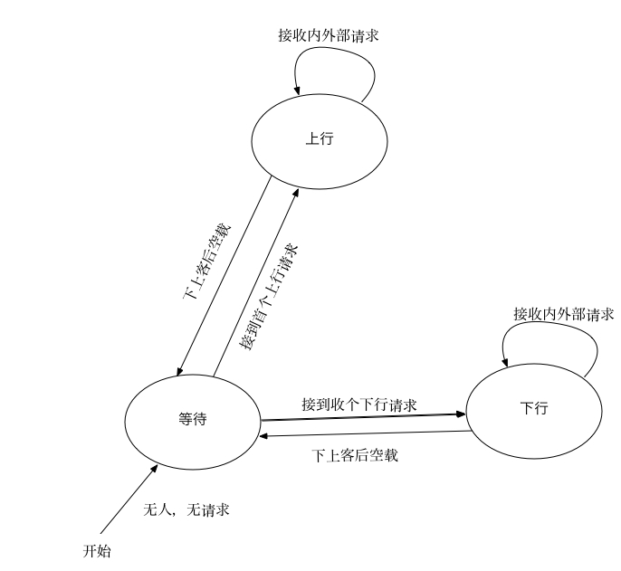

# esched
电梯调度算法设计及实现（此版本设计错误，已停止开发）

## 抽象类型设计
### 电梯
电梯类`Elevator`，单实例名为`elt`，多实例集合名为`elts`。  

##### 容量和负荷
容量(`capacity`)是`elt`最基本的属性，其单位为`人`。负荷(`load`)是`elt`当前载有的人数，其单位为`人`。这里假设一个很重要的前提：每个人的重量被视为相等的。因此我们可以得出一个很简单的结论：

```
0 ≤ load ≤ capacity
```

##### 编号
在一个电梯系统里，每一个电梯有自己的编号`id`。为了保持我们的设计简单，对于一个n电梯的系统，我们为每个电梯编号，且`0 ≤ id ≤ n-1`。

##### 运行状态
一个电梯的运行状态分为三种：

- 等待（`elevatorStatus.WAIT = 0`）
- 上行（`elevatorStatus.GO_UP = 1`）
- 下行（`elevatorStatus.GO_DOWN = 2`）

一个电梯处于`等待`状态的充分必要条件是：接管请求表中不存在请求；处于`上行`状态的充分必要条件是：接管请求表中的所有请求楼层高于当前楼层；处于`下行`状态的充分必要条件是：接管请求表中的所有请求楼层低于当前楼层。

##### 当前楼层
一个电梯有一个当前楼层的记录`sty`。

##### 接管请求表
一个`elt`在上行时，所接管的请求只能都是上行请求。同样，在下行的时候，其接管的请求只能是下行请求。因此我们只在`elt`中维护一个接管请求表`tbl`。接管请求表是`Array`的实例，存储的值为布尔类型，`true`代表将要前往该楼层，`false`代表不会前往该楼层。注意此处的**接管请求表**和全局的**请求表**的数据结构完全不同。

##### 内部请求
一个人进入电梯时，需要选择要前往的楼层。假设一个人不会选择与当前`elt`相反方向的楼层，也不会选择当前楼层。当接受到一个内部请求，则直接登记到接管请求表中即可。

### 请求表
我们可以注意到，对于任何一个多电梯系统，每个电梯所对应的请求在任意时刻是相同的。所以我们通过一个全局的请求表来登记**外部**请求。  
一共应设计两个请求表：上行请求表`reqTbl.up`和下行请求表`reqTbl.down`。每个请求表是`Array`的实例，存储的类型为整数类型，其值如下表所述：

- `0`代表在对应楼层没有请求。
- `任意正整数`代表在对应楼层有请求，该数值为该请求人数。

请求类型根据请求表不同，上行请求表中记录的请求均为上行请求，下行请求表中记录的请求均为下行请求。需要注意的是，楼层是从1开始的（底层），而请求表中的下标是从0开始的。也就是说，请求表中下标为i的请求记录对应着楼层i+1的请求记录。  

## 电梯运行状态管理策略
电梯的运行状态形成一个有限确定状态机。

## 时间说明
在一个单位时间内，可以完成下面的一件事情：

- 电梯从楼层i到i+1
- 电梯从楼层i到i-1

其他任何动作视为无时间开销。本项目的最终产品当中，点击一次`单步运行`将执行一个单位时间。

## 版权声明
本项目不做正式开源项目运营，因此不提供开源许可证。所有项目代码仅供学习参考。
允许用户任意传播源代码。严禁以任何第三方名义修改源代码后执行再发布。
所有设计文档、代码及其他项目内资源的版权属于[吴迪](http://github.com/tjwudi)。